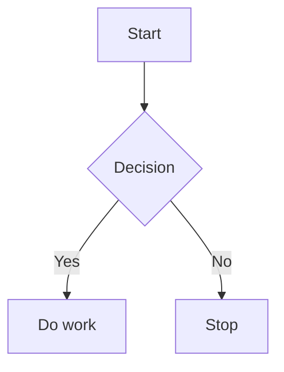

# Mermaid Flow Zoom

Mermaid Flow Zoom improves rendered Mermaid diagrams in Obsidian with zooming, panning, resizing, and fullscreen viewing.

## Features

- Mouse wheel zooms around the pointer.
- Drag to pan the diagram.
- Trackpad horizontal scrolling, `Shift` + wheel, or wheel near the left/right edge pans horizontally.
- Toolbar controls for zoom in, zoom out, reset, and fullscreen.
- Reset and first render fit the complete Mermaid SVG proportionally and center it in the container.
- Desktop container resizing from the lower-right corner.
- Mobile one-finger pan and two-finger pinch zoom.
- Works with dynamically rendered Mermaid diagrams in Reading view and Live Preview where Obsidian exposes rendered SVGs.

## Installation

### Community plugin directory

After the plugin is accepted into the Obsidian community plugin directory:

1. Open Obsidian Settings.
2. Go to Community plugins.
3. Search for `Mermaid Flow Zoom`.
4. Install and enable the plugin.

### Manual installation

1. Download `main.js`, `manifest.json`, and `styles.css` from the latest release.
2. Create this folder inside your vault:

```text
<vault>/.obsidian/plugins/mermaid-flow-zoom/
```

3. Put the downloaded files in that folder.
4. Reload Obsidian.
5. Enable `Mermaid Flow Zoom` in Community plugins.

## Usage

Open a note containing a Mermaid diagram, for example:

````markdown

````

After Obsidian renders the diagram, use the mouse, touchpad, toolbar, or touch gestures to inspect the flowchart.

## Release Checklist

For each GitHub release, attach these files as release assets:

- `main.js`
- `manifest.json`
- `styles.css`

The release tag must exactly match the `version` in `manifest.json`, for example `1.0.0`.

## License

MIT
